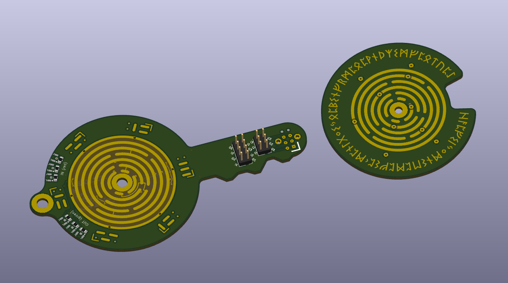

# Hall Jumper Selector Matrix

A tool to help getting the configuration of hall sensors correct for any arbitrary 3-phase electric motor fitted with such devices. There are 6 possible arrangements, for direct and inverse rotations, and shifts relative to the phases. A 2x04 matrix is sufficient to select each arrangement by connecting adjacent pins.

A document that gives [more information on the arrangements](hall-jumper-matrix.pdf) can be found here.

## Hall Key

A simple yet elaborate mechanical device to ease the task of finding the correct jumper configuration ; special care was taken to reduce wear on the sliding contacts and thus extend the device life.
It looks pretty and is a somewhat mystical object that you can carry around everywhere you go.

***NOTE: In the above picture, the tracks are wrong ; this was fixed***

Datasheets of the required components are included.

### Note on the circular tracks

Considering the electrical and mechanical constraints, there is a unique solution to the arrangement ; therefore, it can be considered as a rune.

## Hall Matrix

A 2x04 pins jumper configuration matrix ; this project also includes a dedicated a solder jumper matrix footprint for Kicad. The pogo pins of the selector key go there, and they can be soldered once the correct configuration has been found.

***WARNING: footprint is not up-to-date with latest version of key!***

To ensure it can be accessed with the key, this footprint should go at the edge of the board.

An alternative is to use 2x04 header pins and regular jumpers ; this enables the configuration to be changed easily afterwards. In the case, connect to the key with a short cable.
