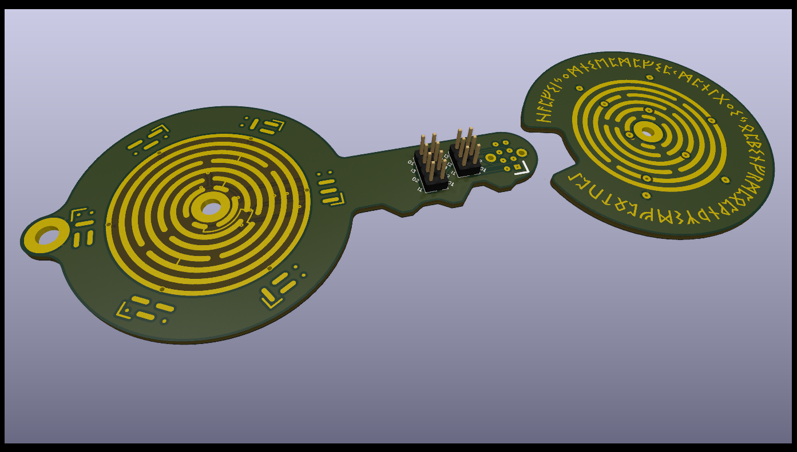

# Hall Jumper Selector Matrix

A tool to help getting the configuration of hall sensors correct for any arbitrary motor fitted with such devices.

## Hall Matrix

A 2x04 pins jumper configuration matrix ; this project also includes a dedicated a solder jumper matrix footprint for Kicad.

## Hall Key

A simple yet elaborate mechanical device to ease the task of finding the correct jumper configuration ; special care was taken to reduce wear on the sliding contacts and this extend the device life.
It looks pretty and is a somewhat mystical object that you can carry around everywhere you go.

Datasheets of the required components are included.

### Note on the circular tracks

Considering the electrical and mechanical constraints, there is a unique solution to the arrangement ; therefore, it can be considered as a rune.
